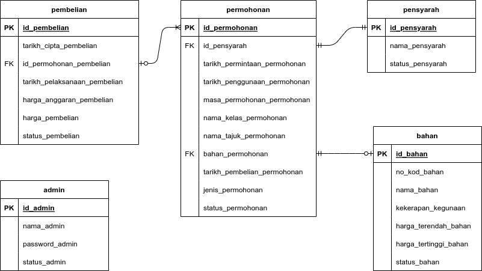

# E-Ordering

E-ordering is a digital material ordering system that impliments cutting edge tech and empowers seamless and paperless order for lecterur and PICs. 

## Problem Statement
- Ingredient Orders are duplicated due to manual examination
- PICs need to make a separate orders after collecting from lecturer
- Lack of systematic ordering system and increase possibilities of missing an order omission
- Generating an ordering manually is time consuming 

## Objective
- Enhance the functionality of the digital teaching and learning system
- Improve efficiency of material ordering and procurement for bakery and pastry practical
- Create a user-friendly system refine the teaching and learning process of lecturers.
- Enhance the functionality of the digital teaching and learning system
- Build an environmentally sustainable digital system that reduce the use of paper
- Streamline and simplify the calculation process of material ordering

## Benefits
- Can be accessed at any time with various devices(Mobile Phones, Tablets and Computers.
- Record, track and store previous orders in efficiently in a cloud based database.
- Streamline and simplify the ordering and price calculation process for each ingredients ordering.

## Impact on teacing and learning
- Help provide a realistic example to the students about how to manage and generate an ingredient ordering form.
- Give more time for lecturers to focus on students rather than spending an unnecessary amount of time generating an ordering.

## UML
[Entity Relationship Diagram (ERD)](documentation/UML/erd.drawio) 